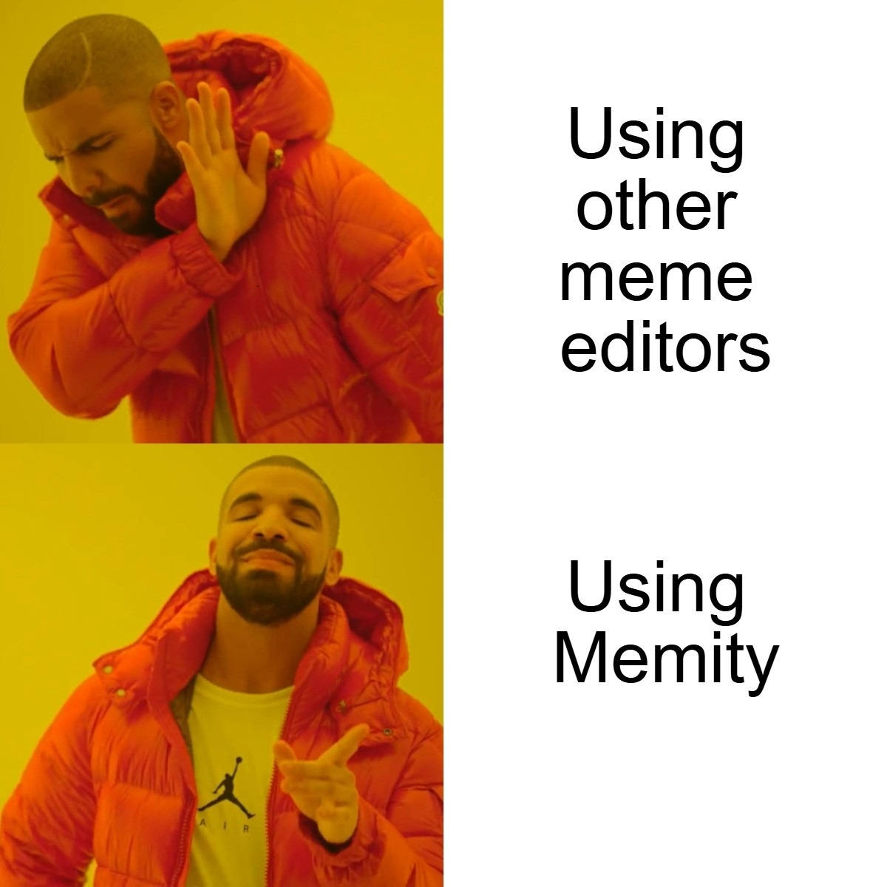

# 🎭 Memity - Professional Meme Editor

[](https://nextjs.org/)
[](https://www.typescriptlang.org/)
[](https://tailwindcss.com/)
[](LICENSE)

> Create viral memes instantly with our professional drag-and-drop meme editor! 🚀



## ✨ Features

### 🎨 **Professional Meme Creation**
- **Drag & Drop Text Editor** - Position text elements anywhere on your meme
- **Real-time Preview** - See changes instantly without clicking update buttons
- **Custom Text Styling** - Fonts, colors, sizes, bold, italic, and alignment options
- **Template Library** - Pre-loaded popular meme templates including Drake, Distracted Boyfriend, and more
- **High-Quality Downloads** - Export your memes in crisp, shareable quality

### 🎭 **Popular Templates Included**
- **Drake Hotline Bling** - Perfect for showing preferences
- **Distracted Boyfriend** - Great for temptation scenarios
- **Woman Yelling at Cat** - Ideal for arguments or confusion
- **Two Buttons** - Perfect for difficult decisions
- **Change My Mind** - Express controversial opinions
- **Expanding Brain** - Show evolution of ideas

### 🌟 **Modern UI/UX**
- **Dark Theme** with glass-morphism design
- **Responsive Layout** - Works on desktop, tablet, and mobile
- **Smooth Animations** - Professional hover effects and transitions
- **Intuitive Interface** - Easy to use for beginners and pros

## 🚀 Quick Start

### Prerequisites
- Node.js 18+ 
- pnpm (recommended) or npm

### Installation

1. **Clone the repository**
   ```bash
   git clone https://github.com/CaliburVolt/Memity.git
   cd Memity
   ```

2. **Install dependencies**
   ```bash
   pnpm install
   # or
   npm install
   ```

3. **Start development server**
   ```bash
   pnpm dev
   # or
   npm run dev
   ```

4. **Open in browser**
   ```
   http://localhost:3000
   ```

## 📁 Project Structure

```
my-app/
├── src/
│   ├── app/
│   │   ├── editor/          # Main meme editor interface
│   │   │   └── page.tsx
│   │   ├── templates/       # Meme templates gallery
│   │   │   └── page.tsx
│   │   ├── globals.css      # Global styles
│   │   ├── layout.tsx       # App layout
│   │   └── page.tsx         # Landing page
│   └── types/
│       └── editor.ts        # TypeScript interfaces
├── public/
│   ├── Drake_Hotline_Bing_Meme_Template_V1.jpg
│   └── templates/           # Meme template images
├── package.json
└── README.md
```

## 🎯 Usage Guide

### Creating Your First Meme

1. **Start Creating**
   - Visit the homepage and click "Start Creating Memes"
   - Or go directly to `/editor`

2. **Choose Your Base**
   - **Upload your own image** using the upload button
   - **Use a template** from `/templates` page
   - **Start with blank canvas** and add text directly

3. **Add Text**
   - Click "Add Text" to create a new text element
   - Type your meme text in the text input
   - Drag text elements to position them perfectly

4. **Customize Styling**
   - Choose from multiple font families
   - Adjust font size with the slider
   - Pick colors using the color picker
   - Make text bold or italic
   - Set text alignment (left, center, right)

5. **Download & Share**
   - Click "Download Meme" to save your creation
   - Share on social media to make it go viral! 🔥

### Using Templates

1. **Browse Templates**
   - Visit `/templates` to see all available meme templates
   - Search by name or filter by category
   - Preview templates in grid or list view

2. **Edit Template**
   - Click "Edit" on any template to open it in the editor
   - Template will automatically load with the image
   - Add your custom text and download

## 🛠️ Tech Stack

- **Framework**: Next.js 15.5.2 with App Router
- **Language**: TypeScript for type safety
- **Styling**: Tailwind CSS 4.0 with custom components
- **Icons**: Lucide React for consistent iconography
- **Canvas**: HTML5 Canvas API for image manipulation
- **File Handling**: HTML5 File API for uploads and downloads

## 🎨 Design System

### Color Palette
- **Primary**: Cyan (#06b6d4) - Interactive elements
- **Secondary**: Purple (#a855f7) - Accents and gradients
- **Background**: Slate-900 to Purple-900 gradient
- **Text**: White and gray variants for optimal contrast

### Typography
- **Headings**: Bold, gradient text effects
- **Body**: Clean, readable sans-serif
- **UI Elements**: Consistent sizing and spacing

## 🚦 Available Scripts

```bash
# Development
pnpm dev          # Start development server
pnpm build        # Build for production
pnpm start        # Start production server
pnpm lint         # Run ESLint

# Type Checking
pnpm type-check   # Run TypeScript compiler
```

## 📦 Dependencies

### Core
- `next`: 15.5.2
- `react`: 19.0.0
- `typescript`: 5.0+

### UI & Styling
- `tailwindcss`: 4.0
- `lucide-react`: Icons
- `file-saver`: Download functionality

### Development
- `@types/node`: Node.js types
- `@types/react`: React types
- `eslint`: Code linting

## 🤝 Contributing

We welcome contributions! Here's how you can help:

1. **Fork the repository**
2. **Create a feature branch**: `git checkout -b feature/amazing-feature`
3. **Commit your changes**: `git commit -m 'Add amazing feature'`
4. **Push to branch**: `git push origin feature/amazing-feature`
5. **Open a Pull Request**

### Development Guidelines
- Follow TypeScript best practices
- Use Tailwind CSS for styling
- Maintain responsive design
- Write clear commit messages
- Test your changes thoroughly

## 🐛 Bug Reports

Found a bug? Please open an issue with:
- Clear description of the problem
- Steps to reproduce
- Expected vs actual behavior
- Screenshots if applicable
- Browser and device information

## 🗺️ Roadmap

### Upcoming Features
- [ ] More meme templates
- [ ] Image filters and effects
- [ ] Sticker and emoji support
- [ ] Social media sharing integration
- [ ] User accounts and saved memes
- [ ] Mobile app version

## 📄 License

This project is licensed under the MIT License - see the [LICENSE](LICENSE) file for details.

## 🙏 Acknowledgments

- **Drake Hotline Bling** meme template - Original template from popular internet meme
- **Tailwind CSS** - For the amazing utility-first CSS framework
- **Next.js** - For the powerful React framework
- **Lucide** - For beautiful, consistent icons

## 📧 Contact

- **GitHub**: [@CaliburVolt](https://github.com/CaliburVolt)
- **Project**: [Memity](https://github.com/CaliburVolt/Memity)

---

<div align="center">

**Made with ❤️ for the meme community**

[⭐ Star this repo](https://github.com/CaliburVolt/Memity) | [🐛 Report Bug](https://github.com/CaliburVolt/Memity/issues) | [💡 Request Feature](https://github.com/CaliburVolt/Memity/issues)

</div>
